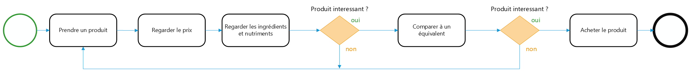
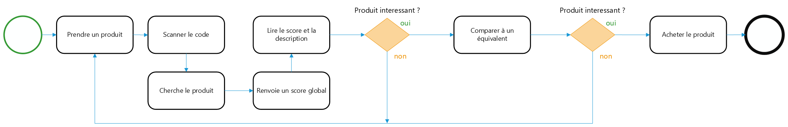
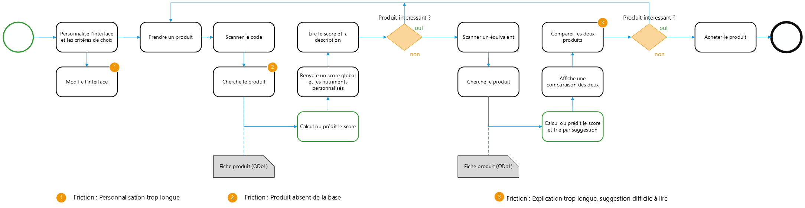

# Note de cadrage — NutriScope

## Sommaire

*Cliquez sur un titre pour y accéder.*

- [1. Contexte et besoin](#1-contexte-et-besoin)
  - [1.1 L'objectif du projet](#11-lobjectif-du-projet)
  - [1.2 Le parcours d'achat, aujourd'hui et demain](#12-le-parcours-dachat-aujourdhui-et-demain)
  - [1.3 Ce que la direction attend](#13-ce-que-la-direction-attend)
  - [1.4 Échéances annoncées par la direction](#14-échéances-annoncées-par-la-direction)
- [2. Marché et positionnement](#2-marché-et-positionnement)
  - [2.1 Les acteurs en place](#21-les-acteurs-en-place)
  - [2.2 Comparaison des fonctionnalités](#22-comparaison-des-fonctionnalités)
  - [2.3 Ce que personne ne fait](#23-ce-que-personne-ne-fait)
  - [2.4 Forces, faiblesses, opportunités et menaces](#24-forces-faiblesses-opportunités-et-menaces)
  - [2.5 La proposition de valeur de NutriScope](#25-la-proposition-de-valeur-de-nutriscope)
- [3. Pour qui : parties prenantes et utilisateurs](#3-pour-qui--parties-prenantes-et-utilisateurs)
  - [3.1 Les parties prenantes](#31-les-parties-prenantes)
  - [3.2 La cible prioritaire : les familles pressées](#32-la-cible-prioritaire--les-familles-pressées)
  - [3.3 Les autres profils d'utilisateurs](#33-les-autres-profils-dutilisateurs)
  - [3.4 Comment les besoins ont été validés](#34-comment-les-besoins-ont-été-validés)
- [4. Périmètre](#4-périmètre)
  - [4.1 Les données de départ](#41-les-données-de-départ)
  - [4.2 Les rayons couverts au lancement](#42-les-rayons-couverts-au-lancement)
  - [4.3 Les produits retenus dans le catalogue](#43-les-produits-retenus-dans-le-catalogue)
  - [4.4 Les informations conservées sur chaque produit](#44-les-informations-conservées-sur-chaque-produit)
  - [4.5 La qualité des données](#45-la-qualité-des-données)
  - [4.6 Les données collectées sur les utilisateurs](#46-les-données-collectées-sur-les-utilisateurs)
  - [4.7 Les limites connues du périmètre](#47-les-limites-connues-du-périmètre)
- [5. Faisabilité](#5-faisabilité)
- [6. Valeur, coûts et rentabilité](#6-valeur-coûts-et-rentabilité)
  - [6.1 La valeur créée par NutriScope](#61-la-valeur-créée-par-nutriscope)
  - [6.2 Les coûts d'exploitation sur 12 mois](#62-les-coûts-dexploitation-sur-12-mois)
  - [6.3 Les coûts de conception](#63-les-coûts-de-conception)
  - [6.4 Les revenus possibles](#64-les-revenus-possibles)
  - [6.5 Bilan et hypothèses fragiles](#65-bilan-et-hypothèses-fragiles)
- [7. KPI, ROI et adoption](#7-kpi-roi-et-adoption)
  - [7.1 Les indicateurs de réussite du produit](#71-les-indicateurs-de-réussite-du-produit)
  - [7.2 Coûts, revenus et ROI sur deux ans](#72-coûts-revenus-et-roi-sur-deux-ans)
  - [7.3 Les indicateurs d'adoption](#73-les-indicateurs-dadoption)
  - [7.4 Comment ces indicateurs seront utilisés](#74-comment-ces-indicateurs-seront-utilisés)
- [8. Risques](#8-risques)
- [Annexe A — Détail des informations conservées](#annexe-a--détail-des-informations-conservées)
- [Annexe B — Catégories du top 20 écartées](#annexe-b--catégories-du-top-20-écartées)
- [Annexe C — Trame de l'entretien semi-directif](#annexe-c--trame-de-lentretien-semi-directif)

---

## 1. Contexte et besoin

[↑ Retour au sommaire](#sommaire)

### 1.1 L'objectif du projet

L'entretien mené avec la direction a permis de préciser l'ambition de NutriScope : proposer un outil accessible à tout le monde, qui fournit à chaque utilisateur des recommandations nutritionnelles personnalisées.

### 1.2 Le parcours d'achat, aujourd'hui et demain

Pour choisir un produit, un consommateur fait aujourd'hui sans outil, ou utilise une application existante comme Yuka. NutriScope propose un nouveau parcours.

**Situation actuelle (AS-IS)**

> Parcours d'une personne qui choisit un produit sans outil

> Parcours d'une personne qui choisit un produit avec Yuka

**Situation cible (TO-BE)**

> Parcours d'une personne qui choisit un produit avec NutriScope

### 1.3 Ce que la direction attend

Le livrable doit comprendre :

- une fonction de recherche de produit ;
- la possibilité de scanner le code-barres d'un produit ;
- pour ces deux accès, l'affichage de la fiche synthétique du produit ;
- un outil de comparaison entre plusieurs produits ;
- un assistant conversationnel qui propose des recommandations à l'utilisateur ;
- une interface mobile fluide et rassurante.

Deux de ces fonctionnalités ont été précisées :

- **Comparer en scannant (« multi-scan »).** L'utilisateur peut scanner plusieurs produits d'affilée pour les comparer au fur et à mesure, principalement sur leur score. Il compare ainsi directement les produits qu'il a devant lui en magasin.
- **Personnaliser l'interface dès l'installation.** L'utilisateur choisit l'ordre d'affichage des critères nutritionnels selon ce qui compte le plus pour lui (sucres, additifs…).

### 1.4 Échéances annoncées par la direction

- une démonstration sous deux semaines ;
- un pilote sous trois mois ;
- une version finalisée sous quatre mois.

---

## 2. Marché et positionnement

[↑ Retour au sommaire](#sommaire)

### 2.1 Les acteurs en place

Quatre acteurs ont été étudiés.

**Yuka**

L'application de référence du marché : 22 millions d'utilisateurs en France, 6 millions de produits, alimentaire et cosmétiques. Elle attribue une note unique sur 100, calculée à 60 % sur la nutrition, 30 % sur les additifs et 10 % sur le bio ; si un additif est jugé à risque, la note est plafonnée à 49. Son modèle est freemium : l'application est gratuite, avec un abonnement à 10 € par an qui débloque la recherche sans scan, le mode hors ligne et les alertes personnalisées. Aucune publicité, base de données propriétaire, pas d'API.

*Limites.* La pondération 60/30/10 ne repose sur aucune justification scientifique publiée, et le concepteur du Nutri-Score la juge arbitraire. En pratique, la pénalité liée aux additifs écrase le signal nutritionnel : des fruits secs et des biscuits salés peuvent obtenir la même note. La note est donnée sans explication. Les fonctions les plus utiles en magasin (hors ligne, recherche) sont payantes. L'écosystème est fermé : ni API, ni licence de données.

**myLabel**

L'approche inverse : pas de note unique, mais 21 critères que l'utilisateur choisit lui-même, répartis entre santé, planète et société. Deux personnes peuvent donc obtenir deux résultats différents pour le même produit. L'application ajoute un score nutritionnel ajusté à l'âge, au sexe et à la portion réellement consommée. Gratuite, elle se finance en vendant des études aux marques. Elle compte 800 000 produits et très peu d'utilisateurs.

*Limites.* Très peu d'utilisateurs, catalogue étroit, aucune formule publiée : on ne sait pas ce que le score calcule réellement. L'application ne fonctionne pas quand le réseau passe mal en magasin, c'est-à-dire au moment précis où l'on en a besoin. Son modèle économique repose sur la revente des données d'usage aux marques.

**Open Food Facts**

Moins un concurrent que le fournisseur de données de NutriScope. C'est une association à but non lucratif qui gère une base collaborative sous licence ouverte : 4,5 millions de produits et une API publique gratuite. Son application affiche les scores officiels (Nutri-Score, NOVA, score environnemental), sans calculer de note maison ni trancher à la place de l'utilisateur. Elle propose les meilleurs filtres allergènes et régimes du panel.

*Limites — le point le plus important pour NutriScope.* Environ un tiers des fiches françaises sont incomplètes ou incohérentes. Nos propres mesures le confirment (section 4.5) : le Nutri-Score n'est exploitable que sur 37 % des produits, l'unité des valeurs nutritionnelles est inconnue sur 72 % des fiches et les marques ne sont pas normalisées. Autre risque : l'association ne finance que 30 % de son infrastructure et son serveur principal fonctionne à trois fois sa capacité. NutriScope dépend donc d'un service fragile.

**ScanUp**

L'application grand public n'est plus maintenue depuis fin 2023 : le vrai métier de la société est la vente d'études aux industriels. Ses données, fournies directement par les fabricants, sont plus propres, mais son catalogue est le plus petit du panel et elle n'a pas d'API.

*Limites.* Produit abandonné côté grand public, catalogue le plus réduit, et un problème de fond : les données viennent des industriels, qui sont aussi les clients payants de la société.

### 2.2 Comparaison des fonctionnalités

✅ présent · 🔒 payant · ➖ absent

| Fonctionnalité | Yuka | myLabel | Open Food Facts | ScanUp | NutriScope |
|---|---|---|---|---|---|
| Note de synthèse unique | ✅ | ➖ | ➖ | ➖ | ✅ |
| Note quand le Nutri-Score est absent | ➖ | ➖ | ➖ | ➖ | ✅ |
| Explication du calcul de la note | ➖ | ➖ | ➖ | ➖ | ✅ |
| Alternatives plus saines | ✅ | ✅ | ✅ | ✅ | ✅ |
| Reconnaissance du produit par photo | ➖ | ➖ | ➖ | ➖ | ✅ |
| Assistant conversationnel | ➖ | ➖ | ➖ | ➖ | ✅ |
| Additifs | ✅ | ✅ | ✅ | ✅ | ➖ |
| Filtres allergènes / régimes | 🔒 | ➖ | ✅ | ➖ | ➖ |
| Personnalisation au profil | ➖ | ✅ | ➖ | ➖ | ➖ |
| Mode hors ligne | 🔒 | ➖ | ➖ | ➖ | ➖ |
| API publique | ➖ | ➖ | ✅ | ➖ | ✅ |
| Entièrement gratuit | ➖ | ✅ | ✅ | ✅ | ✅ |
| Comparaison en temps réel (scans d'affilée) | ➖ | ➖ | ➖ | ➖ | ✅ |

### 2.3 Ce que personne ne fait

C'est sur ces manques que NutriScope se positionne.

1. **Personne n'explique la note.** Yuka donne un chiffre, myLabel des smileys, Open Food Facts des lettres brutes. Aucun ne dit pourquoi.
2. **Personne ne note les produits sans Nutri-Score officiel.** Ils représentent pourtant 63 % du catalogue. Les quatre applications restent muettes sur ces produits ou affichent « inconnu ».
3. **Personne ne signale quand la donnée n'est pas fiable.** Un tiers des fiches sont de mauvaise qualité, et aucune application ne l'indique à l'utilisateur.
4. **Personne ne croise un filtre personnel avec les alternatives proposées** (par exemple : « je veux du bio, donc proposez-moi un substitut bio »).

D'autres besoins sont également mal couverts (mode hors ligne gratuit, prise en compte de la portion réelle, liste de courses), mais ils sortent du périmètre de la première version et sont inscrits au backlog.

### 2.4 Forces, faiblesses, opportunités et menaces

**Forces (internes)**

- NutriScope note les produits que les autres ignorent.
- Il explique la note et cite ses sources.
- API ouverte et données sous licence libre.
- Périmètre resserré à 7 rayons : approfondir plutôt qu'élargir.

**Faiblesses (internes)**

- Une équipe de 2 à 3 personnes et 216 heures, face à une entreprise de 20 salariés.
- Un catalogue limité à 7 rayons et à la France.
- Aucune notoriété.
- Ni cosmétiques, ni mode hors ligne, ni filtres allergènes en première version.
- Une dépendance totale à Open Food Facts.

**Opportunités (externes)**

- Un marché qui double en cinq ans.
- Le Nutri-Score est connu de 93 % des Français, mais seuls 18 % le citent spontanément : il y a tout à expliquer.
- Son algorithme a changé en 2025 et 30 à 40 % des produits changent de lettre, sans que personne ne l'explique.
- Les critiques sur l'opacité des notes sont publiques et documentées.

**Menaces (externes)**

- Yuka domine le marché avec 88 % des utilisateurs français.
- Les industriels attaquent ce type d'application en justice.
- Open Food Facts est financièrement fragile.
- Les données d'entrée sont sales.
- Le Nutri-Score lui-même est contesté, et certains industriels s'en retirent.
- Sur ce marché, les utilisateurs désinstallent vite.

### 2.5 La proposition de valeur de NutriScope

**En une phrase**

> NutriScope note tous les produits, y compris les deux tiers qui n'affichent aucun Nutri-Score, montre d'où vient chaque note et permet de comparer les produits de façon poussée.

**En un paragraphe**

Aujourd'hui, une application de scan donne une lettre ou un chiffre sans dire comment il a été obtenu, et reste muette quand le produit n'a pas de Nutri-Score, soit environ deux produits sur trois. NutriScope calcule le score manquant à partir de la composition du produit, explique clairement ce qui le tire vers le bas, signale quand la fiche est trop incomplète pour que la note soit sûre, et propose un produit comparable mieux noté dans le même rayon. Nous ne demandons pas de faire confiance à une note : nous montrons sur quoi elle repose.

NutriScope propose en outre le « multi-scan » (section 1.3), qui permet de comparer plusieurs produits plus rapidement et plus intuitivement. Le temps gagné en magasin permet de comparer davantage de produits et améliore l'expérience de l'utilisateur.

**Ce que NutriScope ne fait pas, et assume :** ni cosmétiques, ni conseil médical, ni suivi de régime personnalisé.

---

## 3. Pour qui : parties prenantes et utilisateurs

[↑ Retour au sommaire](#sommaire)

### 3.1 Les parties prenantes

Les parties prenantes ont été classées selon leur pouvoir sur le projet et leur intérêt pour celui-ci.

| Posture | Pouvoir | Intérêt | Parties prenantes |
|---|---|---|---|
| À gérer en permanence | Fort | Fort | Équipe data |
| À satisfaire en permanence | Fort | Faible | Direction, délégué à la protection des données (DPO) |
| À tenir informées | Faible | Fort | Marketing, utilisateurs finaux |
| À surveiller | Faible | Faible | Open Food Facts (fournisseur de données) |

### 3.2 La cible prioritaire : les familles pressées

Le public visé est la population générale, avec un accent particulier sur les familles pressées : elles ne veulent pas passer beaucoup de temps à faire leurs courses, mais souhaitent tout de même faire attention à ce qu'elles consomment.

**Fatima, 46 ans — famille pressée**

- Mère de deux enfants, elle travaille avec son mari pour subvenir aux besoins du foyer et n'a pas le temps de faire les courses longtemps.
- Besoin : savoir si un produit est bon pour ses enfants en un scan et un clic.
- Usage : en magasin avec ses enfants, elle garde un œil sur eux tout en scannant ses produits habituels.
- Attentes : le Nutri-Score visible en un regard, les additifs nocifs, des alternatives plus saines.

### 3.3 Les autres profils d'utilisateurs

**Jean, 32 ans — suivre sa consommation de calories**

- Grand sportif, il va à la salle de sport et prépare un marathon.
- Besoin : se faire plaisir tout en suivant une alimentation stricte pour rester en forme.
- Usage : il scanne ses produits favoris pour repérer ceux qui ont le meilleur équilibre sucres / protéines.
- Attentes : un accès rapide aux sucres et aux protéines, ses catégories d'aliments préférées, pas de description détaillée.

**François, 56 ans — intolérances et troubles digestifs**

- Il souffre d'un syndrome de dyspepsie fonctionnelle (troubles gastriques). Célibataire, il n'aime pas cuisiner et achète des plats préparés.
- Besoin : surveiller la quantité de certains nutriments ingérés sur une courte période.
- Usage : il vérifie les ingrédients et la quantité des nutriments.
- Attentes : la liste des ingrédients et le détail utile à son confort digestif.

**Eva, 24 ans — régime végétarien ou végétalien**

- Étudiante au petit budget, elle souhaite manger mieux et de façon plus écoresponsable.
- Besoin : réduire sa consommation de protéines animales.
- Usage : depuis chez elle, elle cherche des alternatives écoresponsables qui couvrent ses besoins nutritionnels.
- Attentes : les labels (végan) bien visibles et l'origine des produits.

**Anne, 35 ans — mieux manger pour sa santé**

- Besoin : connaître le score global d'un produit et le comparer à des produits meilleurs pour sa santé.
- Usage : en magasin, elle scanne et regarde quel produit a le meilleur Nutri-Score.
- Attentes : le Nutri-Score visible en un regard, les additifs nocifs, des alternatives plus saines.

### 3.4 Comment les besoins ont été validés

Les besoins ont été confrontés à la direction lors d'un entretien semi-directif de dix questions (trame en annexe C). Cet entretien a conduit à faire des familles pressées la cible prioritaire (section 3.2).

---

## 4. Périmètre

[↑ Retour au sommaire](#sommaire)

### 4.1 Les données de départ

NutriScope s'appuie sur la base Open Food Facts, export du 29/07/2026 (chiffres issus du notebook `notebooks/tp2-profiling.ipynb`).

L'export mondial contient 4 636 471 produits décrits par 111 colonnes, soit 7,3 Go : c'est trop volumineux pour nos machines. Deux réductions ont été faites :

1. **Seuls les produits vendus en France sont conservés**, soit 1 257 105 produits. Ce choix rejoint la demande de la direction de privilégier les produits trouvables en France.
2. **Seules 19 colonnes sur 111 sont conservées.**

Le fichier passe ainsi de 7,3 Go à 275 Mo, ce qui rend le projet faisable.

### 4.2 Les rayons couverts au lancement

Parmi les 20 catégories les plus présentes dans les données, 7 rayons ont été retenus selon trois critères :

1. **Les plus représentés** : un rayon avec peu de produits ne permet pas de proposer d'alternative intéressante.
2. **Les plus globaux** : quand une catégorie et sa sous-catégorie figurent toutes les deux dans la liste, la catégorie large est retenue.
3. **Bien distincts les uns des autres** : un dessert et une viande n'ont rien à voir, c'est ce qui est recherché. Si deux rayons se recouvrent, un seul est gardé.

| Rayon | Catégorie Open Food Facts | Produits |
|---|---|---|
| Snacks | `en:snacks` | 109 304 |
| Boissons | `en:beverages` | 71 259 |
| Viandes | `en:meats` | 63 842 |
| Fruits et légumes | `en:fruits-and-vegetables-based-foods` | 51 649 |
| Desserts | `en:desserts` | 39 089 |
| Fromages | `en:cheeses` | 33 924 |
| Poissons | `en:fishes` | 17 861 |

Six de ces rayons font partie du top 20. Les poissons, moins nombreux, ont été ajoutés car ils correspondent à un vrai rayon de magasin et complètent les viandes. Les catégories du top 20 écartées sont détaillées en annexe B.

Un même produit pouvant appartenir à plusieurs catégories, les volumes du tableau ne s'additionnent pas. Le nombre de produits restant après application de tous les filtres reste à calculer.

### 4.3 Les produits retenus dans le catalogue

Un produit entre dans le catalogue s'il remplit toutes les conditions suivantes :

| Critère | Raison |
|---|---|
| Il appartient à au moins un des 7 rayons | sinon, impossible de lui proposer un produit comparable |
| Il a un nom | l'utilisateur doit reconnaître le produit à l'écran |
| Il a au moins une image | pour la fiche produit et pour la reconnaissance par photo |
| Il renseigne l'énergie, les sucres, le sel, les matières grasses et les protéines pour 100 g | ce sont les données nécessaires au modèle |
| Sa fiche est remplie au moins à 50 % | pour éliminer les fiches presque vides |

Le Nutri-Score n'est **pas** exigé : les produits qui n'en ont pas sont précisément ceux dont on veut prédire la note, ce qui est au cœur de la proposition de valeur (section 2.5).

Pour l'énergie, seule la valeur en kcal est conservée ; les valeurs exprimées en kJ sont converties.

Sont également écartés :

| Écarté | Raison |
|---|---|
| Les produits hors France | lancement sur le marché français |
| Les produits sans catégorie | ils représentent 50,5 % du catalogue France, mais sans catégorie aucune substitution n'est possible |

### 4.4 Les informations conservées sur chaque produit

Pour chaque produit, NutriScope conserve :

- **son identité** : code-barres, nom, quantité, et l'indication que les valeurs nutritionnelles sont données pour 100 g ou par portion ;
- **son classement** : marques, catégories, labels (bio, sans gluten…) et origine ;
- **sa composition** : ingrédients et additifs ;
- **sa qualité nutritionnelle** : valeurs nutritionnelles, Nutri-Score (lettre et score chiffré), niveau de transformation (NOVA) et niveaux de nutriments ;
- **des indicateurs complémentaires** : taux de remplissage de la fiche, note et score environnementaux ;
- **ses photos**.

Les 92 colonnes écartées relèvent de quatre groupes :

- **les informations sur les contributeurs** : ce sont des pseudonymes de personnes, inutiles au projet, et les garder imposerait de les gérer dans le registre RGPD ;
- **les doublons** : pour les marques, catégories, labels et origines, seule la version normalisée est gardée, la version en texte libre étant sale ;
- **les informations calculées à partir du Nutri-Score** : les utiliser pour prédire le Nutri-Score reviendrait à laisser le modèle tricher. Les niveaux de nutriments sont conservés, mais uniquement pour l'affichage, jamais comme donnée d'entrée du modèle ;
- **ce qui ne sert pas NutriScope** : l'emballage et la distribution n'ont pas de lien avec la qualité nutritionnelle. Ces colonnes pourront être ajoutées plus tard sans changer l'architecture.

Le détail colonne par colonne figure en annexe A.

### 4.5 La qualité des données

**Les dimensions de qualité les plus critiques pour NutriScope**

- **La cohérence** : NutriScope compare des produits sur des chiffres, ces chiffres doivent donc être cohérents entre eux.
- **La validité** : mélanger des unités fausserait les comparaisons.
- **L'exactitude** : sans valeurs exactes, les comparaisons perdent leur sens.

**Les problèmes constatés**

*Les marques ne sont pas normalisées.* On compte 90 819 marques différentes, mais le nombre réel est plus faible : « carrefour » (11 070 produits) et « Carrefour » (4 188) sont comptées comme deux marques distinctes ; il en va de même pour « u » / « U » et « leclerc » / « e-leclerc ». Tout regroupement par marque donne donc un résultat faux.
→ Action prévue : tout passer en minuscules, retirer le préfixe `xx:` et regrouper les alias.

*On ignore souvent à quoi correspondent les valeurs nutritionnelles.* L'indication « pour 100 g ou par portion » est vide pour 72,1 % des produits, dont 826 832 ont pourtant des valeurs nutritionnelles. C'est le problème le plus sérieux du jeu de données : une valeur fausse mais visible se repère facilement, une valeur juste exprimée dans la mauvaise unité, non. De plus, 4 812 produits sont explicitement renseignés par portion et ne peuvent être comparés aux autres qu'après conversion.

*Certaines valeurs sont impossibles.* Pour 100 g de produit, aucun nutriment ne peut dépasser 100 g. Pourtant :

| Problème | Nombre de produits |
|---|---|
| Sucres > 100 g | 49 |
| Matières grasses > 100 g | 44 |
| Sel > 100 g | 55 |
| Protéines > 100 g | 34 |
| Valeurs négatives | 9 |
| Énergie > 3 800 kJ | 121 |

C'est peu au regard de 1,2 million de produits, mais des erreurs moins visibles existent : pour 4 029 produits, la somme des macronutriments dépasse 100 g.
→ Action prévue : borner les valeurs entre 0 et 100, vérifier leur cohérence, et consigner les lignes écartées (jamais de suppression silencieuse).

*Le Nutri-Score est bien moins présent qu'il n'y paraît.* Le champ est rempli à 98 %, mais souvent avec des valeurs inutilisables :

| Valeur | Produits | Part |
|---|---|---|
| inconnu (`unknown`) | 724 267 | 57,6 % |
| E | 133 097 | 10,6 % |
| D | 123 443 | 9,8 % |
| C | 97 192 | 7,7 % |
| A | 63 414 | 5,0 % |
| B | 49 615 | 3,9 % |
| non applicable (`not-applicable`) | 41 306 | 3,3 % |
| vide | 24 771 | 2,0 % |

Un Nutri-Score utilisable (A à E) ne concerne donc que **37,1 %** des produits.

*Les nutriments clés manquent souvent* : 28,7 % des produits pour l'énergie, 29,3 % pour les sucres, 33,7 % pour le sel.

**Ce qui est fiable**

Les codes-barres : 27 doublons sur 1 257 105 produits, soit 0,002 %. L'identifiant des produits est propre.

### 4.6 Les données collectées sur les utilisateurs

La cible principale étant les familles pressées, NutriScope ne pose pas de questions sur l'état de santé de ses utilisateurs. Pour les allergènes, l'application affiche les informations essentielles, dont la liste des ingrédients : l'utilisateur peut ainsi vérifier lui-même si un produit contient des ingrédients à risque pour lui. Ce choix évite de manipuler des données de santé, juridiquement sensibles.

Certaines données restent nécessaires au bon fonctionnement de l'application : les préférences de produits et l'historique, afin d'affiner les recommandations au fil de l'utilisation. La direction souhaite le maximum de personnalisation possible dans le cadre imposé ; le niveau exact reste à valider avec le DPO, notamment la conservation de l'historique de recherche.

### 4.7 Les limites connues du périmètre

- **Le rayon Snacks reste large.** Il regroupe le sucré et le salé ; il faudra probablement le découper en sous-catégories pour que la substitution ait du sens.
- **La qualité n'a pas été vérifiée rayon par rayon.** Les rayons ont été choisis sur le volume et la distinction entre eux, sans contrôler le remplissage du Nutri-Score dans chacun.
- **Les rayons peuvent se recouper.** Un même produit peut appartenir à plusieurs des 7 catégories ; il faudra décider à quel rayon le rattacher.
- **Le volume final du catalogue** après application de tous les filtres n'est pas encore connu.

---

## 5. Faisabilité

[↑ Retour au sommaire](#sommaire)

Chaque brique a été évaluée sous trois angles.

| Brique | Technique | Organisationnelle | Juridique et éthique |
|---|---|---|---|
| Score expliqué | NOK — les données, les compétences et l'infrastructure sont presque réunies | OK | NOK — pas de contrainte, pas de données utilisateurs |
| Substitution | NOK — les données sont presque réunies ; compétences et infrastructure disponibles | OK | OK — utilisation des données utilisateur pour des propositions plus précises |
| Assistant | OK | OK | NOK — l'assistant peut inventer des réponses, ce qui pose des limites éthiques |

---

## 6. Valeur, coûts et rentabilité

[↑ Retour au sommaire](#sommaire)

### 6.1 La valeur créée par NutriScope

À partir des données publiques de Yuka, la valeur du temps gagné par les utilisateurs de NutriScope a été estimée ainsi :

| Étape | Valeur |
|---|---|
| Utilisations annuelles de Yuka dans le monde | 2,7 milliards |
| dont en France (base du calcul) | 670 millions |
| Hypothèse de part de marché de NutriScope | 5 % |
| Utilisations annuelles de NutriScope | 33,5 millions |
| Temps gagné par utilisation | 30 secondes |
| SMIC net horaire | 9,5 € |
| Valeur du temps gagné par utilisation | 0,08 € |
| Hypothèse de taux de succès | 15 % |
| **Valeur annuelle** | **402 000 €** |

Calcul : 33,5 millions × 0,08 € × 15 % = 402 000 € par an.

Ce montant mesure la valeur du temps gagné par les utilisateurs ; il ne s'agit pas d'un chiffre d'affaires pour NutriScope (voir 6.4).

### 6.2 Les coûts d'exploitation sur 12 mois

Le chiffrage porte sur ce que coûterait NutriScope s'il fonctionnait réellement en production pendant un an, selon trois scénarios : pessimiste, central et optimiste.

**Hébergement de l'application, de la base de données et de l'interface**

Pour une première version à faible trafic, un hébergement simple (serveur privé ou plateforme d'hébergement type Scalingo, Railway, OVH, Fly.io) est préféré à une grosse infrastructure cloud.

| Poste | Hypothèse | Coût mensuel | Coût annuel |
|---|---|---|---|
| Application et interface | 1 petit serveur (2 processeurs virtuels, 4 Go de mémoire) | ~25 € | ~300 € |
| Base de données | PostgreSQL managé, petite offre | ~20 € | ~240 € |
| Base documentaire de l'assistant | Qdrant ou Chroma, instance légère sur le même serveur | inclus ou ~10 € | ~0-120 € |
| **Total hébergement** | | **~45-55 €** | **~540-660 €** |

Au volume visé (de quelques centaines à quelques milliers d'utilisateurs), un serveur simple suffit. Le coût n'augmente fortement qu'en cas de trafic massif.

**Assistant conversationnel**

Le coût dépend du nombre de conversations par jour, de la taille moyenne d'une conversation et du prix du modèle de langage choisi. Le fournisseur facture au volume de texte traité, compté en tokens.

Hypothèses : un modèle économique de type GPT-4o-mini ou Mistral Small (~0,15 € par million de tokens reçus, ~0,6 € par million de tokens produits) et une conversation moyenne de 1 500 tokens en entrée (question et extraits de documents cités) pour 500 tokens en sortie.

| Scénario | Conversations/jour | Conversations/an | Coût annuel |
|---|---|---|---|
| Pessimiste | 50 | ~18 250 | ~10 € |
| Central | 200 | ~73 000 | ~40 € |
| Optimiste | 800 | ~292 000 | ~155 € |

Un modèle économique coûte très peu par conversation. Le vrai risque n'est pas le prix unitaire, mais un usage massif ou un modèle mal choisi : un modèle haut de gamme, 20 à 50 fois plus cher, changerait complètement le calcul. Le coût par conversation devra donc être suivi en continu, et pas seulement estimé une fois.

**Stockage des images**

Les photos des produits sont déjà hébergées par Open Food Facts ; on suppose toutefois un cache local ou des miniatures générées pour l'application.

| Scénario | Volume stocké | Coût par Go par mois | Coût annuel |
|---|---|---|---|
| Pessimiste | 20 Go | 0,02 € | ~5 € |
| Central | 50 Go | 0,02 € | ~12 € |
| Optimiste | 150 Go | 0,02 € | ~36 € |

Le stockage est le poste le moins cher. Le coût caché serait la bande passante si l'application diffusait elle-même des millions d'images ; s'appuyer sur les liens Open Food Facts en première version évite ce risque.

**Temps humain**

C'est de très loin le poste principal. Une fois l'application déployée, il faut du temps pour la maintenance, le support et les évolutions.

Hypothèse : 3 heures par semaine sur environ 44 semaines actives, à un taux chargé de 45 € de l'heure (ordre de grandeur d'un alternant ou d'un junior, charges comprises), soit 132 heures × 45 € = **~5 940 € par an**.

En cas de maintenance à temps plein (en phase de croissance par exemple), ce chiffre peut être multiplié par 10 ou plus. C'est le paramètre le plus fragile : il dépend entièrement du niveau d'ambition retenu pour la suite.

**Récapitulatif des coûts annuels**

Le détail poste par poste ci-dessus correspond au scénario central :

| Poste | Scénario central |
|---|---|
| Hébergement | 600 € |
| Assistant conversationnel | 40 € |
| Stockage des images | 12 € |
| Temps humain | 5 940 € |
| **Total** | **~6 590 €** |

Les coûts d'exploitation annuels retenus pour le calcul de rentabilité (section 7.2) sont de **8 573 €** dans le scénario pessimiste, **6 615 €** dans le scénario central et **5 307 €** dans le scénario optimiste. Le total du détail ci-dessus (~6 590 €) est cohérent avec le scénario central. Dans cette logique, le scénario pessimiste est celui où l'exploitation coûte le plus cher et le scénario optimiste celui où elle coûte le moins.

Dans le scénario central, le temps humain représente environ 90 % du coût total. L'enjeu financier du projet n'est pas l'infrastructure, mais les personnes qui la font vivre.

### 6.3 Les coûts de conception

Les coûts de conception ne sont pas intégrés au coût d'exploitation annuel : ils sont ajoutés à l'année 1 dans le calcul de rentabilité (section 7.2). En prenant pour référence le volume du projet (216 heures) et une équipe de 3 personnes :

216 heures × 3 personnes × 45 € de l'heure = **29 160 €**.

Cette estimation est volontairement simple : l'équipe n'est pas mobilisée à 100 % sur chaque séance. Ce chiffre constitue donc un plafond raisonnable, pas une mesure fine.

### 6.4 Les revenus possibles

Lors de l'entretien, la direction a indiqué que le modèle économique reposerait sur des partenariats avec des marques et des entreprises.

Trois modèles observés chez les concurrents (section 2.1) ont été appliqués à NutriScope selon trois scénarios : pessimiste, central et optimiste. Les revenus obtenus alimentent le calcul de rentabilité de la section 7.2.

**Freemium (comme Yuka)**

L'application est gratuite, avec un abonnement qui débloque des fonctions avancées (recherche sans scan, alertes personnalisées, historique).

- Hypothèse de conversion : 5 % des utilisateurs actifs s'abonnent, un taux réaliste pour une première version sans notoriété.
- Prix : 3 € par mois (soit 36 € par an), à ajuster.
- Utilisateurs actifs en fin d'année : 8 000 (pessimiste), 10 000 (central), 12 000 (optimiste).
- Calcul du scénario central : 10 000 × 5 % × 3 € × 12 mois = **18 000 € par an**. Le scénario pessimiste donne 14 400 € et le scénario optimiste 21 600 €.

C'est le modèle le plus proche de celui du leader du marché, mais il suppose une base d'utilisateurs importante, difficile à atteindre sans budget d'acquisition.

**B2B (comme myLabel ou ScanUp)**

L'application reste gratuite pour le grand public ; le revenu vient de la vente de données anonymisées ou d'études à des marques, des distributeurs ou des acteurs de la santé (mutuelles, assureurs).

- Hypothèse : des clients (par exemple une enseigne de distribution et une mutuelle) à 6 000 € par an chacun, pour un accès à des tableaux de bord agrégés par rayon. On suppose 2 clients (pessimiste), 3 (central) et 4 (optimiste).
- Calcul du scénario central : 3 × 6 000 € = **18 000 € par an**. Le scénario pessimiste donne 12 000 € et le scénario optimiste 24 000 €.

Ce modèle valorise les données nettoyées, qui constituent l'actif le plus solide du projet. En contrepartie, il exige du volume et une réputation de neutralité pour convaincre ces clients ; ScanUp, par exemple, a perdu cette neutralité en abandonnant Open Food Facts pour des données « propres » mais fermées.

**Marque blanche**

La technologie (score, moteur de substitution, assistant) est cédée sous licence à un tiers (distributeur, application santé) qui l'intègre sous sa propre marque.

- Hypothèse : 1 licence à 15 000 € par an avec un distributeur régional ou une chaîne de magasins bio, maintenance et évolutions mineures incluses. Cette hypothèse est la même dans les trois scénarios, car le revenu dépend d'un seul contrat.
- Calcul : **15 000 € par an**.

C'est le modèle qui rapporte le plus par client, mais il dépend d'un seul contrat : perdre ce client, c'est perdre tout le revenu. Le freemium, à l'inverse, répartit le risque sur de nombreux petits utilisateurs.

**Synthèse**

| Modèle | Pessimiste | Central | Optimiste | Dépendance principale | Risque principal |
|---|---|---|---|---|---|
| Freemium | 14 400 € | 18 000 € | 21 600 € | Volume d'utilisateurs et notoriété | Faible taux de conversion sans budget marketing |
| B2B | 12 000 € | 18 000 € | 24 000 € | Qualité et volume des données | Besoin de crédibilité et de neutralité auprès des marques |
| Marque blanche | 15 000 € | 15 000 € | 15 000 € | Un seul contrat | Risque concentré sur un seul client |

### 6.5 Bilan et hypothèses fragiles

Les revenus du scénario central (15 000 à 18 000 € par an) couvrent le coût d'exploitation annuel (environ 6 600 €). En revanche, une fois le coût de conception intégré (section 6.3), aucun modèle n'est rentable la première année, et seuls deux scénarios optimistes le deviennent au bout de deux ans (section 7.2). Ce chiffrage reste de plus volontairement optimiste sur l'acquisition d'utilisateurs et de clients.

Trois hypothèses sont particulièrement fragiles :

1. **Un taux de conversion freemium de 5 %.** Sans budget d'acquisition ni notoriété face à Yuka (88 % des utilisateurs français, section 2.4), ce taux pourrait être surestimé d'un facteur 2 à 5, y compris pour atteindre les 8 000 à 12 000 utilisateurs actifs supposés.
2. **Un temps humain de 3 heures par semaine.** Il serait sous-estimé si l'assistant génère du support utilisateur (réponses erronées, garde-fous à ajuster) ou en cas d'incidents d'infrastructure, comme en connaît Open Food Facts avec un serveur utilisé à trois fois sa capacité.
3. **La signature de contrats B2B ou marque blanche en 12 mois.** Ces ventes nécessitent plusieurs mois de négociation : ce sont des hypothèses de moyen terme, pas de première année.

Ces hypothèses d'adoption sont suivies par les indicateurs de la section 7.3.

---

## 7. KPI, ROI et adoption

[↑ Retour au sommaire](#sommaire)

Cette section fixe comment on saura si NutriScope fonctionne : ce qu'on mesure, ce que le projet coûte et rapporte, et comment on réagit si les utilisateurs n'adoptent pas l'application. Les coûts reprennent la section 6.2 (exploitation) et la section 6.3 (conception), les revenus la section 6.4.

### 7.1 Les indicateurs de réussite du produit

Six indicateurs suivent la réussite du produit. Chacun répond à un objectif précis. Les baselines sont à zéro (sauf le coût et la note) car l'application n'est pas encore en production.

| Objectif | KPI | Baseline | Cible | Source de mesure |
|---|---|---|---|---|
| Mesurer | Scans par jour | 0 | 50 000 | Logs de l'API |
| Cibler | Nouveaux utilisateurs activés | 0 | 20 000 | Base des abonnés |
| Fidéliser | Rétention à 30 jours | 0 % | 30 % | Analytics de l'application |
| Faire changer | Taux de substitution acceptée | 0 % | 10 % | Événement « alternative choisie » |
| Tenir les coûts | Coût par requête de l'assistant (*) | 0,00048 € | 0,00040 € | Facturation du modèle de langage et du cloud |
| Satisfaire | Note et commentaires sur les stores d'applications | 1 | 3,8 / 5 | Notes des stores d'applications |

(*) La baseline de 0,00048 € est un coût estimé, pas encore mesuré. Elle est cohérente avec les hypothèses de la section 6.2 (1 500 tokens en entrée, 500 en sortie). Elle sera remplacée par la valeur réelle dès les premières semaines de production.

### 7.2 Coûts, revenus et ROI sur deux ans

**Méthode.** Le coût de conception (29 160 €, section 6.3) est payé une seule fois, la première année. Le coût d'exploitation revient chaque année. Le ROI est le gain net divisé par les coûts engagés :

- **ROI an 1** = gain net de l'année 1 ÷ coût total de l'année 1 ;
- **ROI an 2** = gain net cumulé sur deux ans ÷ coûts cumulés sur deux ans.

On suppose que les revenus et les coûts d'exploitation restent identiques en année 2.

| Scénario | Coût d'exploitation (€/an) | Coût de conception (€) | Coût total an 1 (€) | Modèle de revenu | Revenu (€/an) | Gain net an 1 (€) | Gain net cumulé an 2 (€) | ROI an 1 | ROI an 2 |
|---|---|---|---|---|---|---|---|---|---|
| Pessimiste | 8 573 | 29 160 | 37 733 | B2B | 12 000 | −25 733 | −22 306 | −68 % | −48 % |
| Central | 6 615 | 29 160 | 35 775 | B2B | 18 000 | −17 775 | −6 390 | −50 % | −15 % |
| Optimiste | 5 307 | 29 160 | 34 467 | B2B | 24 000 | −10 467 | 8 226 | −30 % | 21 % |
| Pessimiste | 8 573 | 29 160 | 37 733 | Freemium | 14 400 | −23 333 | −17 506 | −62 % | −38 % |
| Central | 6 615 | 29 160 | 35 775 | Freemium | 18 000 | −17 775 | −6 390 | −50 % | −15 % |
| Optimiste | 5 307 | 29 160 | 34 467 | Freemium | 21 600 | −12 867 | 3 426 | −37 % | 9 % |
| Pessimiste | 8 573 | 29 160 | 37 733 | Marque blanche | 15 000 | −22 733 | −16 306 | −60 % | −35 % |
| Central | 6 615 | 29 160 | 35 775 | Marque blanche | 15 000 | −20 775 | −12 390 | −58 % | −29 % |
| Optimiste | 5 307 | 29 160 | 34 467 | Marque blanche | 15 000 | −19 467 | −9 774 | −56 % | −25 % |

**Ce que montre ce tableau**

1. **Aucun scénario n'est rentable la première année.** Le coût de conception pèse à lui seul plus de 80 % des coûts de l'année 1. Le meilleur résultat est un ROI de −30 % (B2B optimiste).
2. **Seuls deux scénarios sont rentables au bout de deux ans** : le B2B optimiste (ROI de 21 %) et le freemium optimiste (9 %). Dans le scénario central, le retour à l'équilibre se situe vers 2,6 ans pour le B2B et le freemium. Il se situe vers 3,5 ans pour la marque blanche. Ces délais supposent des revenus et des coûts constants.
3. **La marque blanche est la moins sensible au scénario**, car le revenu est fixé par un seul contrat (15 000 €) quelle que soit l'évolution de l'usage. Cela limite le risque de mauvaise surprise, mais aussi le potentiel de gain.
4. **Le B2B et le freemium dépendent de l'usage**. Leur résultat s'améliore fortement dans le scénario optimiste, mais se dégrade tout autant dans le scénario pessimiste.

Ce ROI est un ROI financier pour NutriScope. Il est distinct de la valeur créée pour les utilisateurs (402 000 € par an, section 6.1), qui mesure le temps qu'ils gagnent et ne revient pas à l'entreprise.

### 7.3 Les indicateurs d'adoption

Les indicateurs de la section 7.1 mesurent les résultats. Ceux-ci mesurent si les utilisateurs adoptent réellement l'application, car les hypothèses les plus fragiles du chiffrage (section 6.5) sont des hypothèses d'adoption. Chaque indicateur a une définition précise, un seuil d'alerte chiffré et deux plans de relance. Ces plans correspondent aux deux scénarios à anticiper :

- **l'usage plafonne** : seuls les premiers adopteurs utilisent l'application, et la base d'utilisateurs ne s'élargit pas ;
- **l'usage monte puis redescend** : des utilisateurs abandonnent après une mauvaise expérience.

Tous les indicateurs sont des mesures collectives : aucun ne sert à suivre un utilisateur en particulier.

| KPI | Définition | Seuil d'alerte | Plan de relance si l'usage plafonne | Plan de relance si l'usage monte puis redescend |
|---|---|---|---|---|
| Utilisateurs hebdomadaires actifs | Nombre de comptes uniques ayant fait au moins un scan dans la semaine (du lundi au dimanche). Mesure collective, jamais individuelle. | Moins de 500 après 3 mois | Campagne de réactivation ciblée (e-mail et notification) auprès des inscrits inactifs, et test A/B de l'accueil de l'application | Enquête de satisfaction auprès des utilisateurs perdus, et correction en priorité des bugs signalés |
| Rétention à 30 jours | Part des utilisateurs ayant scanné le jour J qui scannent à nouveau entre J+25 et J+35. Mesure par cohorte mensuelle. | Moins de 20 % | Ajout de fonctionnalités qui donnent envie de revenir (historique personnel, objectifs nutritionnels) et programme de parrainage | Analyse des parcours de départ (dernier scan, produit scanné) et amélioration des alternatives proposées |
| Taux de substitution acceptée | Part des sessions où l'utilisateur clique sur au moins une alternative proposée après un scan. Calculé sur toutes les sessions où des alternatives sont disponibles. | Moins de 5 % (cible : 10 %) | Amélioration de la pertinence des substitutions (filtres prix, bio, marques) et test de nouveaux algorithmes de classement | Audit qualitatif des substitutions rejetées (produits introuvables, alternatives peu pertinentes) et recalibrage du modèle |
| Taux de produits sans score | Part des scans qui aboutissent à un produit sans Nutri-Score (officiel ou prédit) et sans alternative proposée. Mesuré sur l'ensemble des scans. | Plus de 25 % des scans sans score exploitable | Extension du périmètre de produits couverts (nouveaux rayons) et accélération du pipeline de nettoyage des données | Communication transparente sur les limites de couverture, et message d'explication quand un produit n'est pas couvert |
| Latence de l'API (P95) | Temps de réponse en millisecondes en dessous duquel passent 95 % des requêtes, hors assistant conversationnel. Mesuré en continu par le tableau de bord d'exploitation. | Plus de 800 ms | Optimisation des requêtes SQL et mise en cache des fiches produits les plus scannées | Montée en puissance du serveur et audit des routes les plus lentes |

### 7.4 Comment ces indicateurs seront utilisés

- **Pilotage.** Les indicateurs de la section 7.1 sont relus à chaque jalon. Ceux de la section 7.3 sont relus chaque mois à partir du pilote.
- **Alerte.** Quand un seuil d'alerte est franchi, l'équipe identifie lequel des deux scénarios s'applique (usage qui plafonne ou usage qui redescend) et déclenche le plan de relance correspondant.
- **Lien avec le ROI.** Les scénarios de la section 7.2 dépendent directement de ces indicateurs : un nombre d'utilisateurs actifs et une rétention proches des cibles correspondent au scénario central ou optimiste. Des seuils d'alerte franchis de façon durable signalent que l'on se rapproche du scénario pessimiste.

---

## 8. Risques

[↑ Retour au sommaire](#sommaire)

Six risques ont été identifiés et évalués selon leur probabilité et leur impact. Les menaces liées au marché sont détaillées en section 2.4.

| Risque | Probabilité | Impact |
|---|---|---|
| Remplacement des codes-barres par des QR codes | Forte | Faible |
| Rangement des produits par Nutri-Score dans les grandes enseignes | Faible | Fort |
| Changement du mode de calcul du Nutri-Score | Forte | Faible |
| Évolution des technologies et des usages (lunettes connectées) | Faible | Moyen |
| Évolution des technologies de développement et dépendances devenues incompatibles | Forte | Fort |
| Arrivée d'un nouveau concurrent qui modifie le marché | Moyenne | Moyen |

---

## Annexe A — Détail des informations conservées

[↑ Retour au sommaire](#sommaire)

Les colonnes de type `STRUCT` ne se lisent pas directement : il faut extraire les champs qu'elles contiennent (voir la vue `products` dans le notebook).

**Général**

| Colonne | Type | Usage |
|---|---|---|
| `code` | VARCHAR | code-barres, identifiant du produit |
| `product_name` | STRUCT(lang, text)[] | nom en plusieurs langues ; on prend le français, à défaut l'anglais |
| `quantity` | VARCHAR | quantité du paquet |
| `nutrition_data_per` | VARCHAR | indique si les valeurs sont pour 100 g ou par portion |

**Classification**

| Colonne | Type | Usage |
|---|---|---|
| `brands_tags` | VARCHAR[] | marques |
| `categories_tags` | VARCHAR[] | catégories, qui définissent les rayons |
| `labels_tags` | VARCHAR[] | labels (bio, sans gluten…) |
| `origins_tags` | VARCHAR[] | provenance |

**Ingrédients**

| Colonne | Type | Usage |
|---|---|---|
| `ingredients_tags` | VARCHAR[] | liste des ingrédients |
| `additives_tags` | VARCHAR[] | additifs |

**Nutrition**

| Colonne | Type | Usage |
|---|---|---|
| `nutriments` | STRUCT("name" VARCHAR, "value" FLOAT, "100g" FLOAT, serving FLOAT, unit VARCHAR, prepared_value FLOAT, prepared_100g FLOAT, prepared_serving FLOAT, prepared_unit VARCHAR)[] | toutes les valeurs nutritionnelles ; on en extrait l'énergie, les sucres, le sel, les matières grasses et les protéines |
| `nutriscore_grade` | VARCHAR | note de A à E |
| `nutriscore_score` | INTEGER | score chiffré |
| `nova_group` | INTEGER | niveau de transformation du produit |
| `nutrient_levels_tags` | — | niveaux de nutriments, pour l'affichage uniquement, jamais en entrée du modèle |

**Qualité et environnement**

| Colonne | Type | Usage |
|---|---|---|
| `completeness` | FLOAT | taux de remplissage de la fiche (entre 0 et 1) |
| `environmental_score_grade` | VARCHAR | note environnementale |
| `environmental_score_score` | INTEGER | score environnemental |

**Images**

| Colonne | Type | Usage |
|---|---|---|
| `images` | STRUCT(...)[] | photos du produit, pour l'application et la reconnaissance par photo |

**Colonnes écartées (92)**

| Groupe | Colonnes | Raison |
|---|---|---|
| Contributeurs | `creator`, `editors`, `photographers`, `correctors_tags`, `informers_tags`, `last_modified_by` | pseudonymes de personnes, inutiles et à gérer dans le registre RGPD si conservés |
| Doublons | `brands`, `categories`, `labels`, `origins` | la version `_tags`, normalisée, est conservée à la place |
| Dérivées du Nutri-Score | `compared_to_category`, `nutriscore_data` | risque de fuite d'information vers le modèle de prédiction |
| Hors besoin | `packagings`, `emb_codes`, `stores_tags`, `purchase_places_tags`, `cities_tags`, `traces_tags`, `minerals_tags`, `vitamins_tags` | sans lien avec la qualité nutritionnelle |

## Annexe B — Catégories du top 20 écartées

[↑ Retour au sommaire](#sommaire)

| Catégorie écartée | Produits | Raison |
|---|---|---|
| `en:plant-based-foods-and-beverages` | 192 272 | trop large, mélange aliments et boissons |
| `en:plant-based-foods` | 166 862 | trop large, recouvre déjà les fruits et légumes |
| `en:sweet-snacks` | 91 745 | sous-catégorie de `en:snacks`, déjà retenue |
| `en:meats-and-their-products` | 83 912 | recouvre `en:meats`, déjà retenue |
| `en:dairies` | 60 169 | recouvre `en:cheeses`, déjà retenue |
| `en:fermented-foods`, `en:fermented-milk-products` | 49 056 / 47 562 | sous-ensembles des produits laitiers |
| `en:biscuits-and-cakes`, `en:prepared-meats`, `en:spreads`, `en:condiments` | 38 000 à 43 000 | trop précises par rapport aux rayons retenus |
| `en:cereals-and-potatoes`, `en:meals`, `en:breakfasts` | 33 000 à 51 000 | bons candidats, mais 7 rayons suffisent pour commencer |

## Annexe C — Trame de l'entretien semi-directif

[↑ Retour au sommaire](#sommaire)

| N° | Question | Thème |
|---|---|---|
| 1 | Pourquoi voulez-vous créer cette application ? | Contexte |
| 2 | Qu'est-ce qui définit la fin du projet ? | Objectif |
| 3 | Quel budget est alloué (temps de travail prévu en jours-homme) ? | Contrainte |
| 4 | À quels produits l'application sera-t-elle étendue ? | Données |
| 5 | Quel est le public ciblé par l'application ? | Utilisateurs |
| 6 | Jusqu'où personnaliser l'application pour chaque utilisateur ? Quelles données collecter ? | Utilisateurs / Données / Contrainte |
| 7 | Quand le projet sera-t-il publié ? | Contrainte |
| 8 | Quelle méthodologie souhaitez-vous appliquer ? | Contrainte |
| 9 | Comment l'équipe sera-t-elle composée, avec quelles compétences ? | Contrainte |
| 10 | Quel est le modèle économique ? Comment l'application rapporte-t-elle de l'argent ? | Contexte / Objectif |
