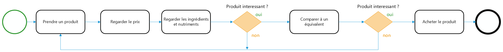
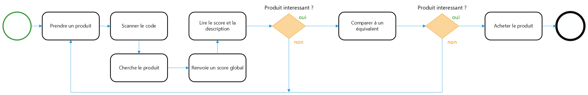
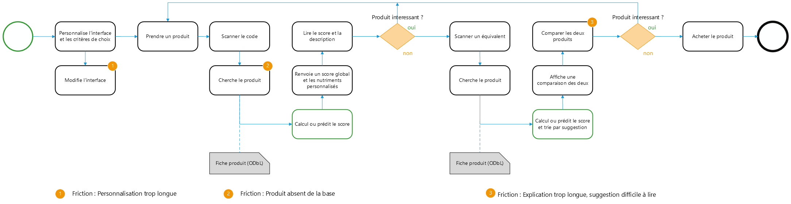

# Processus et parcours sur Nutriscope

### Fonctionnalités :

- Comparaison de produits en scannant :

Permettre de pouvoir scanner plusieurs produits d'affilée pour les comparer dynamiquement, en affichant principalement leur score. Ce qui permet de comparer les produits qui sont directement en magasin.

- Personnalisation de l'interface dès l'installation de l'app

Choisir l'ordre d'affichage des critères de nutrition en fonction de ce qui est le plus important pour la personne (sucres, additifs…)

### Diagrammes

#### AS-IS

>Diagramme d'une personne n'utilisant pas d'outils pour choisir un produit

>Diagramme d'une personne utilisant Yuka pour choisir un produit

#### TO-BE

>Diagramme d'une personne utilisant Nutriscope